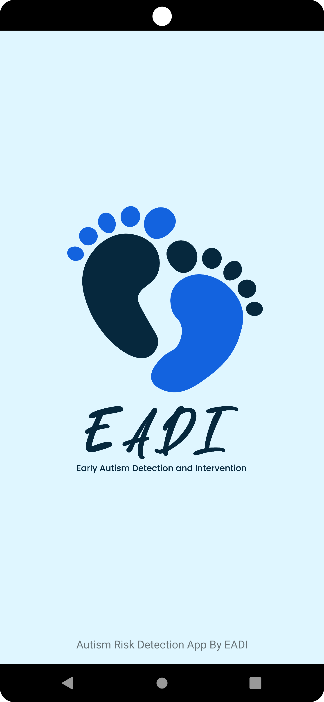

<!-- PROJECT LOGO -->
 

  
  

  
  <h1 align="center">EADI Project</h1>

  

    Early Detection, Lifelong Impact!
     
  

  

<!-- ABOUT THE PROJECT -->
## About The Project

EADI is short for Early Autism Detection Intervention which is an android application that can help parents detect their children who have not detected autism. We will also provide articles that can educate the public. Besides being able to speed up the detection of autism, this application also has the potential to help parents to provide better care for their children.

## Getting Started

Get Started to get a local copy up and running follow these simple example steps.

### Prerequisites

This project requires several resources to be installed on the local computer, including
- [Android Studio](https://developer.android.com/studio)

### Installation

_Below is an example of how you can instruct your audience on installing and setting up your app. This template doesn't rely on any external dependencies or services._

1. Clone the repository

2. Run the apps

    - You can run EADI apps in an emulator or on-device
    - Being able to run the apps means the whole setup is works

(<a href="#top">back to top</a>)

## Application

  </img>&nbsp; &nbsp;&nbsp; &nbsp;

### Minimum Requirements

- Android 7.0 (lollipop) or newest
- Internet Connection
- Camera Access
- 

## Other project
You can also looking up our other repository in this project by this [link](https://github.com/armans28/EADI-Project).

## Acknowledgments
<!-- LOGO BANGKIT AND EADI-->

  
  

